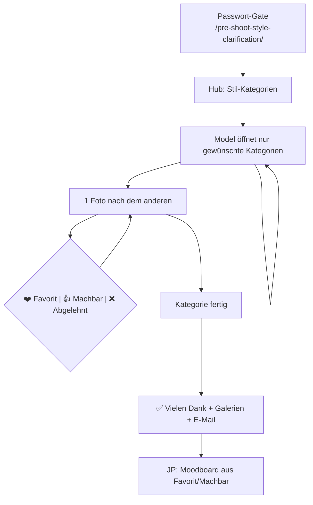

# Pre-Shoot — Spezifikation (aus Live-Site extrahiert)

Stand: Juni 2026. Quelle: `jpstern.com` mit Passwort-Gate + HTML/JS-Analyse.

## Zugang

| Feld | Wert |
|------|------|
| URL | `https://jpstern.com/pre-shoot-style-clarification/` |
| Passwort | `Pre-Shoot` (gemeinsames Passwort für alle Models) |
| Zielgruppe | Nur Models mit **vereinbartem** Shooting — Link + Passwort per DM/Mail |

**Sicherheitslücke (WP heute):** Nur die Hub-Seite ist passwortgeschützt. Die **Kategorie-URLs** (`/pre-shoot-lifestyle/` usw.) sind **ohne Passwort** erreichbar — sensual Beispielbilder öffentlich abrufbar. Beim Statik-Relaunch: **gesamter** `/pre-shoot-*`-Baum hinter Auth.

---

## Model-Journey (Gesamtbild)

```mermaid
flowchart LR
    subgraph vor ["Vor dem Shooting — Priorität Relaunch"]
        A["Model will TFP"] --> B["JP fragt: was möchtest du?"]
        B --> C["Link + Passwort Pre-Shoot"]
        C --> D["Model wählt Kategorien frei"]
        D --> E["Favorit / Machbar / Abgelehnt"]
        E --> F["E-Mail an JP\nFavorit + Machbar = Moodboard"]
        F --> G["Shooting mit klaren Grenzen"]
    end
    subgraph nach ["Nach dem Shooting — später, niedrige Prio"]
        H["JP legt Model-Ordner an"] --> I["Geschützter Link"]
        I --> J["Model wählt Bilder aus"]
        J --> K["JP löscht nach 2–3 Mon."]
    end
    G --> H
```



**Pre-Shoot-Zweck:** Nicht Marketing — **Grenzen und Vorlieben klären**, damit JP vor dem Shooting genau weiss, was geht und was nicht. Model wählt selbst, welche Stil-Bereiche es durchgeht.

**Post-Shoot-Auswahl:** Separates Feature (individuell pro Model, gut geschützt, temporär). Kann anfangs **von Hand** (Ordner + Link); Details später. **Nicht** Teil des ersten Relaunchs.

---

## Pre-Shoot Ablauf (Detail)



---

## Schritt 1 — Hub (nach Passwort)

**Titel:** Pre-Shoot Stilabklärung  
**Untertitel:** Schau die verschiedenen Stile durch und wähle, was Dir gefällt.

**5 Kategorie-Links** (auf Hub verlinkt):

| Button-Label | URL | Fotos |
|--------------|-----|-------|
| LIFESTYLE | `/pre-shoot-lifestyle/` | 50 |
| SENSUAL PORTRAIT | `/pre-shoot-sensual-portrait/` | 63 |
| SENSUAL IMPLIED NUDITY | `/pre-shoot-sensual-implied/` | 45 |
| SENSUAL HOTEL / BEDROOM | `/pre-shoot-sensual-bedroom/` | 60 |
| SENSUAL SHIBARI | `/pre-shoot-sensual-shibari/` | 43 |

**WP heute:** Hub verlinkt 5 Kategorien; `/pre-shoot-sensual-nude/` existiert, hatte aber noch **keine eigenen Bilder** (gleicher Platzhalter-Inhalt wie `implied`).

**Statik-Ziel:** **6 Kategorien** inkl. `sensual-nude` — je eigener Bilder-Ordner.

**Gesamt Beispielbilder (WP Stand):** ~261 in den 5 befüllten Kategorien.

---

## Schritt 2 — Kategorie-Seite (Kern-UX)

Pro Kategorie gleicher Aufbau:

### Einleitung

> Bitte schaue dir die Fotos eines nach dem anderen an und klicke auf den passenden Button.

| Button | Bedeutung |
|--------|-----------|
| ❤️ **Favorit** | Du würdest solche Bilder gerne selbst haben |
| 👍 **Machbar** | Du bist bereit, sowas in der Art zu shooten |
| ❌ **Abgelehnt** | Nicht dein Stil oder ausserhalb deiner Grenzen |

### Review-Modus

- Ein grosses Foto (`#main-photo`), Fortschritt: `X von Y`
- Klick auf Button → Foto landet in passender **Thumbnail-Galerie** unten
- Nächstes Foto wird geladen
- **Review Queue:** Thumbnail anklicken → Foto zurück in Hauptansicht, neu bewerten

### Drei Ergebnis-Galerien (nach Abschluss sichtbar)

| ID | Inhalt |
|----|--------|
| `#fav-gallery` | Favoriten |
| `#alright-gallery` | Machbar |
| `#reject-gallery` | Abgelehnt |

---

## Schritt 3 — Abschluss

Wenn alle Fotos bewertet:

1. **✅ Vielen Dank!** — Hinweis: Auswahl per E-Mail senden oder Galerien nochmal prüfen
2. **Formular:** Name (Pflicht), E-Mail (optional, für Kopie)
3. Button: **«Auswahl per E-Mail senden»**
4. Erklärung: Galerien unten — Klick auf Bild = neu bewerten

### E-Mail-Versand — `send-selection.php` (Hostpoint Root)

Datei im **Webroot**, abhängig von WordPress (`require_once('wp-load.php')`), Versand via `wp_mail()`.

**Request:** POST, Feld `data` = JSON:

```json
{
  "name": "…",
  "email": "…",
  "category": "Lifestyle",
  "fav": ["https://jpstern.com/.../Lifestyle01.webp"],
  "alright": ["https://jpstern.com/.../Lifestyle02.webp"]
}
```

**Mail an `info@jpstern.com`:**

| Feld | Wert |
|------|------|
| Betreff | `Pre-Shoot Selection - {category} - {name}` |
| Format | HTML — Abschnitte **❤️ Favorit** und **👍 Machbar** |
| Bilder | `` — **Hotlinks**, keine Anhänge, kein PDF |
| Kopie | Optional an Model-E-Mail (gleicher Inhalt) |
| Nach Submit | Bestätigungsseite «✅ Gesendet!» |

**Abgelehnt** wird nicht mitgesendet.

#### Warum Bilder in alten Mails «weg» sind

Mail-Clients laden Bilder **beim Öffnen** von der Live-URL. Site-/Upload-Änderungen → tote Links in alten Mails. PDF war nie implementiert.

#### Warum HTTP 500 heute

Vermutlich `wp-load.php` / `wp_mail()` (WP/Plugin/PHP). Beim Statik-Relaunch: **neues PHP ohne WordPress**.

#### Ziel Statik-Relaunch

| Heute | Ziel |
|-------|------|
| `wp-load.php` + `wp_mail()` | PHPMailer / Hostpoint `mail()` |
| HTML mit URL-`` | **Anhänge** (Thumbnails) oder **PDF** — archivfest |
| JS sendet falsche `category` | Pro Kategorie korrekter String |

**Empfehlung:** PDF oder ZIP mit Thumbnails — bei 50+ Bildern pro Kategorie übersichtlicher als 50 Mail-Anhänge.

### Bekannte WP-Bugs (beim Portieren fixen)

| Seite | `category` in E-Mail sollte sein | Ist heute |
|-------|----------------------------------|-----------|
| lifestyle | Lifestyle | Sensual - Implied nudity ❌ |
| portrait | Sensual - Portraits | Sensual - Implied nudity ❌ |
| shibari | Sensual - Shibari | Sensual - Implied nudity ❌ |
| bedroom | Sensual - Hotel / Bedroom | ✅ korrekt |
| implied/nude | Sensual - Implied nudity | ✅ korrekt |

---

## Bilder-Assets

Pfad: `wp-content/uploads/2026/05/`  
Naming: `{Kategorie}{NN}.webp` — z. B. `Lifestyle01.webp` … `Lifestyle50.webp`, `SB01` … `SP01` … `SS01` … `SI01`

IDs im JS: `LI01`, `SB01`, `SP01`, `SS01`, `SI01` usw.

---

## Statik-Portierung (Ziel)

| WP heute | Astro-Ziel |
|----------|------------|
| Custom HTML + inline JS pro Seite | Eine React-Komponente + `categories.json` |
| `send-selection.php` | Formspree / Resend / Hostpoint-Mail-API |
| Nur Hub passwortgeschützt | **Ganzer** Pre-Shoot-Pfad hinter `.htaccess` |
| 6 Seiten (1 Duplikat) | 5 Kategorien + Hub |
| Kein Fortschritt über Kategorien | Optional: Hub zeigt «3/5 Kategorien erledigt» |

**Aufwand Phase 3 (revidiert):** ~3–4 Tage — Logik ist vollständig dokumentiert, Portierung + Auth + E-Mail-Fix.

---

## Entscheidungen (JP, Juni 2026)

| Frage | Entscheidung |
|-------|--------------|
| **`/pre-shoot-sensual-nude/`** | Eigene Kategorie — Bilder fehlten nur (noch nicht hochgeladen). Kein Duplikat-by-design; WP/Elementor war zu mühsam. |
| **E-Mail Inhalt** | Nur **Favorit + Machbar** → Moodboard. **Abgelehnt** nicht an JP. |
| **Passwort** | Ein gemeinsames Passwort ok (`Pre-Shoot`, ab und zu änderbar). Schutz vor «Fuzzis», nicht Hochsicherheit. Model nutzt es **einmal**. |
| **Kategorien** | Model wählt **selbst**, welche Bereiche es macht — z. B. nur Lifestyle, oder Implied + Lifestyle. **Kein** Zwang alle 5 durchzugehen. |
| **Kopie an Model** | E-Mail optional — reicht. |

### Ablauf-Prinzip (Hub)

Model kommt über Link + Passwort → Hub zeigt alle Stile → Model öffnet **nur die Kategorien, die es interessieren** → pro Kategorie Review → E-Mail mit Favorit/Machbar für die bearbeiteten Kategorien.

*(Weitere Ablauf-Details: folgen vom Nutzer.)*

---

## Bilder-Verwaltung — Ziel (statt WP Media-Chaos)

**Problem heute:** Hunderte Bilder im WP-Media-Ordner, nur nach Monat/Jahr sortiert — untauglich für Pre-Shoot-Kategorien.

**Lösung im Astro-Repo:** Ordner pro Kategorie — Bilder reinlegen, fertig. Kein Elementor, kein manuelles `photos = [...]`-Array.

```
jpstern/web/
└── pre-shoot/
    ├── categories.json          # Labels, Reihenfolge, aktiv/ja-nein
    └── images/
        ├── lifestyle/           # *.webp reinlegen → automatisch im Flow
        ├── sensual-portrait/
        ├── sensual-implied/
        ├── sensual-nude/        # eigener Ordner (wenn Bilder da sind)
        ├── sensual-bedroom/
        └── sensual-shibari/
```

**Build-Zeit:** Script liest Ordner → generiert `photos.json` pro Kategorie (Dateiname = Sortierung, z. B. `01-…webp`, `02-…webp`).

**Workflow für JP:** Neue Beispielbilder → in den passenden Ordner kopieren → `npm run build` / Deploy. Kein CMS-Klicken.

**Aufwand:** +0.5 Tag in Phase 3 (Folder-Scanner + `categories.json`) — spart langfristig viel Ärger.

---

## Post-Shoot Bildauswahl (Phase 2 — später)

| Aspekt | Richtung |
|--------|----------|
| **Wann** | Nach dem Shooting — Model wählt Lieblingsbilder |
| **Zugang** | Individuell pro Model, gut geschützt (eigener Link/Passwort) |
| **Lebensdauer** | JP löscht nach ~2–3 Monaten |
| **Betrieb** | Anfangs **manuell** ok (Ordner auf Hostpoint, Link schicken) |
| **Priorität** | **Niedrig** — nach öffentlicher Site + Pre-Shoot |
| **Aufwand später** | Vermutlich einfach: Ordner + Auth + einfache Galerie-Auswahl; Details TBD |

Mögliche Statik-Struktur (Skizze, nicht bauen):

```
post-shoot/
└── models/
    └── {model-slug}-{datum}/
        ├── originals/       # JP legt JPGs/WebPs ab
        └── selections.json  # Model-Haken, oder E-Mail wie Pre-Shoot
```

---

## Noch offen

- [x] `send-selection.php` dokumentiert (Root, wp_mail, HTML-URLs)
- [ ] Neues Mail-Script mit Anhängen beim Relaunch
- [ ] Sensual-Nude: Bilder vorhanden oder erst bei Relaunch befüllen?
- [ ] Post-Shoot: Auswahl-UX (Haken pro Bild? Favoriten? Download?) — später